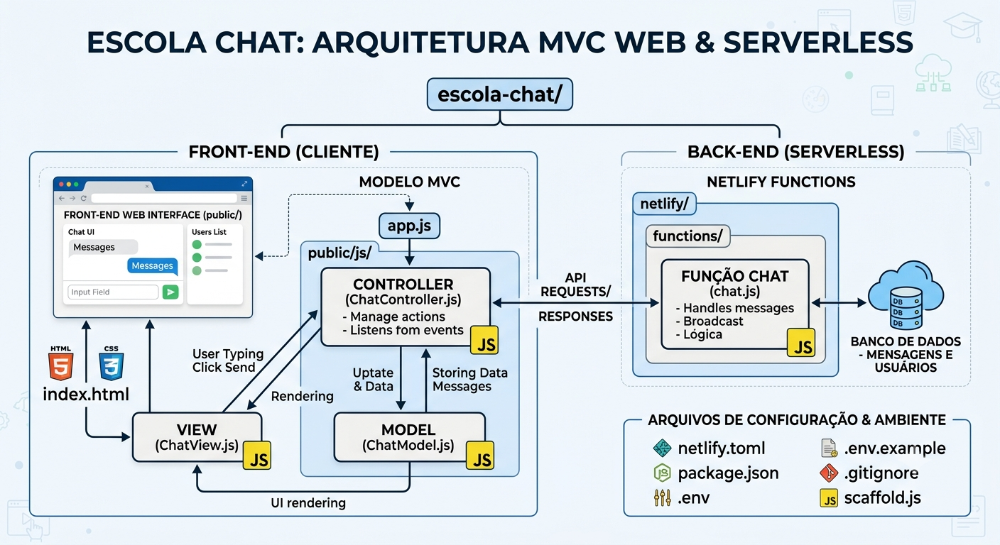

<h1 align="center">
  Escola Chat 🤖
</h1>
<h2 align="center">
  Estrutura de Funcionamento ↓
</h2>

<p align="center">
  
</p>

<h2 align="center">
Assistente virtual inteligente para atendimento escolar utilizando IA
</h2>

<p align="center">
  <a href="chat-bot-eschool.netlify.app" target="_blank">
    
  </a>
</p>

---

- ## 📌 Sobre o Projeto

- O Escola Chat é uma aplicação web desenvolvida para auxiliar no atendimento escolar através de uma assistente virtual baseada em inteligência artificial.

- O objetivo do projeto é oferecer respostas rápidas e organizadas para dúvidas frequentes dos alunos, como informações sobre cursos, matrícula, horários, localização e outros assuntos relacionados à instituição.

- O sistema foi desenvolvido utilizando o padrão arquitetural MVC (Model-View-Controller), proporcionando melhor organização, manutenção e escalabilidade do código.

---

🚀 Tecnologias Utilizadas

- # Front-end

- HTML5
- CSS3
- JavaScript

- #  Back-end / Funções Serverless

- Netlify Functions
- Node.js

- # 🤖 Inteligência Artificial

- API GROQ
- Modelos de linguagem (LLM)

- # 🏗️ Arquitetura

- MVC (Model-View-Controller)

---

📂 Estrutura do Projeto
```
escola-chat/
│
├── public/
│   ├── css/
│   │   └── style.css
│   ├── js/
│   │   ├── model/
│   │   ├── view/
│   │   └── controller/
│   └── index.html
│
├── netlify/
│   └── functions/
│       └── chat.js
│
├── package.json
├── netlify.toml
└── README.md
```
---

- # ⚙️ Como Executar o Projeto Localmente

<h2 align="left">
  Instalar as dependências
</h2>

  - ```npm install```

<h2 align="left">
  Configurar as variáveis de ambiente
</h2>

   -  Copie o arquivo de exemplo:
   - ```.env.example → .env```

<h2 align="left">
  Depois adicione sua chave da API:
</h2>

   - ```GROQ_API_KEY=SUA_CHAVE_AQUI```

<h2 align="left">
  Executar o projeto localmente
</h2>

   -  Utilize o Netlify CLI:
   -  ```npx netlify dev```
   -  O projeto estará disponível no endereço informado pelo terminal.

---

- # 🌐 Deploy no Netlify

Para publicar o projeto:

1. - Envie o código para um repositório no GitHub.
2. - Conecte o repositório ao Netlify.
3. - Configure a variável de ambiente:

Site Settings ↓
```
    → Environment Variables
        → Add variable
            GROQ_API_KEY
```
Após configurar, realize o deploy da aplicação.

---

# 🖥️ Site para realizar Testes

Acesse a versão online:

<p align="center">
  <a href="chat-bot-eschool.netlify.app" target="_blank">
    
  </a>
</p>

---

- # 🏗️ Arquitetura MVC

O projeto utiliza o padrão MVC para separar responsabilidades:

- Model: Gerenciamento dos dados e comunicação com a API.
- View: Interface visual e interação com o usuário.
- Controller: Controle das ações e comunicação entre Model e View.

---

- # 🔒 Segurança

- As chaves de API são armazenadas utilizando variáveis de ambiente.
- Arquivos sensíveis como ".env" não devem ser enviados ao GitHub.
- O projeto utiliza configuração segura para comunicação com serviços externos.

---

## 👨‍💻 Desenvolvedores

Desenvolvido por **Jhuan Silva** com auxílio de **Beatriz Alves**

<p align="center">
  <a href="https://github.com/tsuki0-0">
    
  </a>
</p>
<p align="center">
  <a href="https://github.com/bea3853">
    
  </a>
</p>
